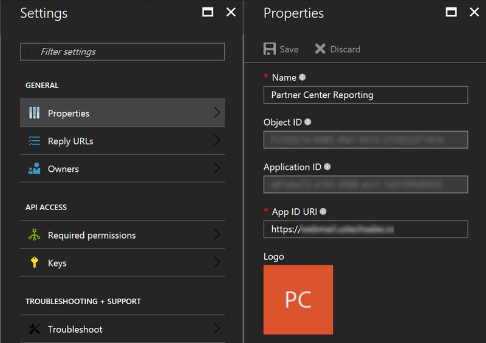

# Deploying Partner Center Reporting
This project depends on several Microsoft Azure services both for performance and security purposes. 
Each of these services enable the API quickly and securely obtain details. The following are all of the 
services required by this project

* Application Insights
* App Services
* Redis Cache
* Key Vault

The remaining sections of this guide will walk you through deploying the project.

## Prerequisites 
The following are _required_ prerequisites in order to perform the steps outlined in this guide. 

| Prerequisite                            | Purpose                                                                                 |
|-----------------------------------------|-----------------------------------------------------------------------------------------|
|  Azure AD global admin privileges       | Required to create the required Azure AD application utilized to obtain access tokens.  |
|  Partner Center admin agent privileges  | Required to perform various Partner Center operations through the Partner Center API.   |

If you do not have the privileges then you will not able to perform the remaining operations in this guide.

## Partner Center Azure AD Application
The Partner Center API is utilized to verify the authenticated user belongs to a customer that 
has a relationship with the configured partner. Perform the following to create the application 

1. Login into the [Partner Center](https://partnercenter.microsoft.com) portal using credentials that have _AdminAgents_ and _Global Admin_ privileges
2. Click _Dashboard_ -> _Account Settings_ -> _App Management_ 
3. Click on _Register existing_ app if you want to use an existing Azure AD application, or click _Add new web app_ to create a new one

    

4. Document the _App ID_ and _Account ID_ values. Also, if necessary create a key and document that value. 

    

## Azure AD Application
Azure AD and Microsoft Graph are utilized to provide authentication and authorization for the project. 
Perform the following tasks to create the required Azure AD application 

1. Login into the [Azure Management Portal](https://portal.azure.com) using credentials associated with your Cloud Solution Provider reseller, or integration sandbox, tenant. 
2. Open the _Azure Active Directory_ user experince and then click _App registration_

    

3. Click _+ Add_ to start the new application wizard
4. Specify an appropriate name for the application, select _Web app / API_ for the application, specify an appropriate value for the sign-on URL, and then click _Create_
5. Click _Required permissions_ button found on the _settings_ blade for the the application and then click _+ Add_
6. Add the following permissions to the _Windows Azure Active Directory_ API the _Sign in and read user profile_ and _Access the directory as the signed-in user_ delegated permissions
7. Add the _Microsoft Graph_ API and  grant it the _Read directory data_ application permission
8. Click _Grant Permissions_ button, found on the _Required Permissions_ blade, to consent to the application for the partner tenant 
9. Click the _Keys_ button found on the _settings_ blade and create a key. Be sure to document this value because you will not be able to retreive the value again after you leave the blade.
10. Configure the application for pre-consent using the steps documented [here](Preconsent.md).

This application will be utilized to generate OAuth access tokens and verify the authenticated user is authorized to make a request. 
The _App ID URI_ value is used to identify the application when requesting a token. Also, it used during the token validation phase.
It should be configured to the same custom domain value you will be assigning to the API application. Perform the following to 
configure the _App ID URI_ 

1. Click the _Properties_ button found on the _Settings_ blade. 
2. Update the _App ID URI_ to match the address you will be assigning to the API application

    

## Azure Key Vault 
Azure Key Vault is used to protect application secrets, connection strings, and passwords. To access the instance of Key Vault 
the toolkit will utilize an Azure AD token for an application that is authorized to access the instance. Perform the following to create 
the application and obtain the necessary object identifier.

1. Login into the [Azure Management Portal](https://portal.azure.com) using credentials associated with your Cloud Solution Provider reseller, or integration sandbox, tenant. 
2. Open the _Azure Active Directory_ user experince and then click _App registration_
3. Click _+ Add_ to start the new application wizard
4. Specify an appropriate name for the application, select _Web app / API_ for the application, specify an appropriate value for the sign-on URL, and then click _Create_
5. Click the _Keys_ button found on the _settings_ blade and create a key. Be sure to document this value because you will not be able to retreive the value again after you leave the blade.
6. Within an elevated instance of PowerShell install the Azure AD module

    ```powershell
    Install-Module AzureAD
    ```

7. Modify the following PowerShell cmdlets accordingly to obtain the object identifier for the service principal name associated with the application

    ```powershell
    Connect-AzureAD 

    Get-AzureADServicePrincipal | Where-Object {$_.DisplayName -eq 'NAME-OF-THE-APPLICATION-CREATED-ABOVE'}
    ```

8. Document the *ObjectId* value it will be used to deploy the template. 

## Deploy the ARM Template 
An Azure Resource Manager (ARM) template has been developed to simplify the deployment of the solution. When you click the 
*Deploy to Azure* below it will take you to a website where you can populate the parameters for the template. 

[](https://portal.azure.com/#create/Microsoft.Template/uri/https%3A%2F%2Fraw.githubusercontent.com%2FMicrosoft%2FPartner-Center-Reporting%2Fmaster%2Fazuredeploy.json)
[](http://armviz.io/#/?load=https%3A%2F%2Fraw.githubusercontent.com%2FMicrosoft%2FPartner-Center-Reporting%2Fmaster%2Fazuredeploy.json)

The following table provides details for the appropriate value for each of the parameters.

| Parameter                             | Value                                                                                                             |
|---------------------------------------|----------------------------------------------------------------------------------------------|
| Application Id                        | Identifier for the application created in the Azure AD Application section                   |
| Application Secret                    | Secret key create in the step 9 of the Azure AD application section                          |
| Application Tenant Id                 | Identifier for the tenant where the application from the Azure AD Application was created    |
| Audience                              | Identifies the recipient resource the token authentication.                                  |
| Key Vault Application Id              | Identifier for the Azure AD application created in the *Azure Key Vault* section             |
| Key Vault Application Secret          | Secret key for the Azure AD application created in the *Azure Key Vault* section             |
| Key Vault Name                        | Name for the Key Vault. This name should not contain any special characters or spaces        |
| Key Vault Tenant Id                   | Identifier for the tenant where the instance of Azure Key Vault is being created             |
| Object Id                             | Identifier for the service principal name obtained from the *Azure Key Vault* section        |
| Partner Center Application Id         | App ID value obtained from the Partner Center Azure AD Application section                   |
| Partner Center Application Secret     | Key created in the Partner Center Azure AD Application section                               | 
| Partner Center Application Tenant Id  | Account ID value obtained from the Partner Center Azure AD Application section               |

## Post Deployment 
Follow the steps documented [here](https://docs.microsoft.com/en-us/azure/app-service-web/app-service-web-tutorial-custom-domain) to assign 
the custom domain for the API application.
